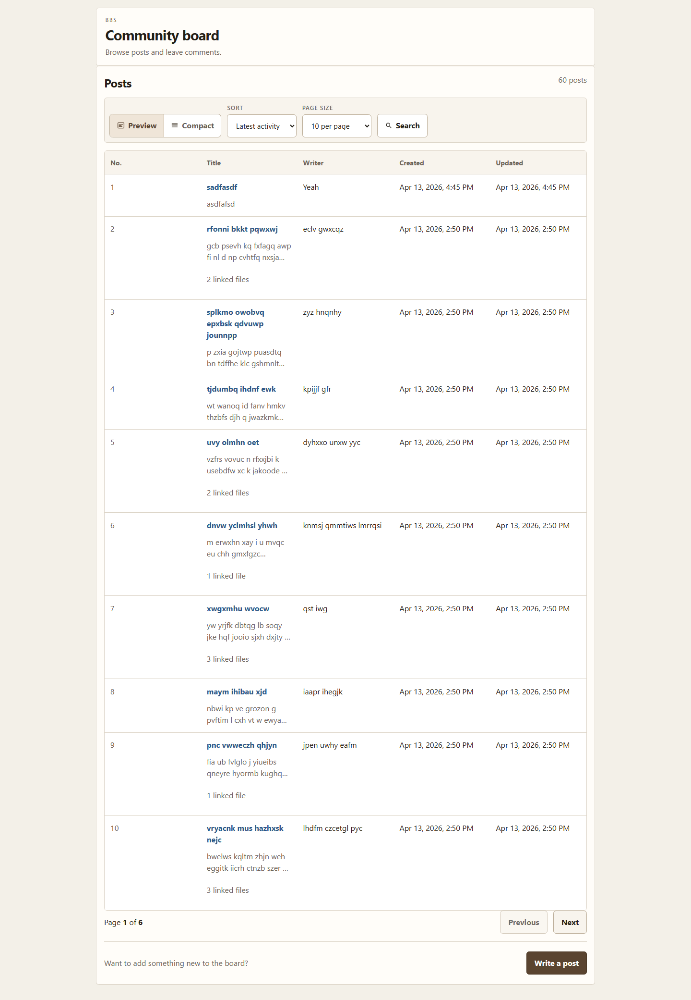
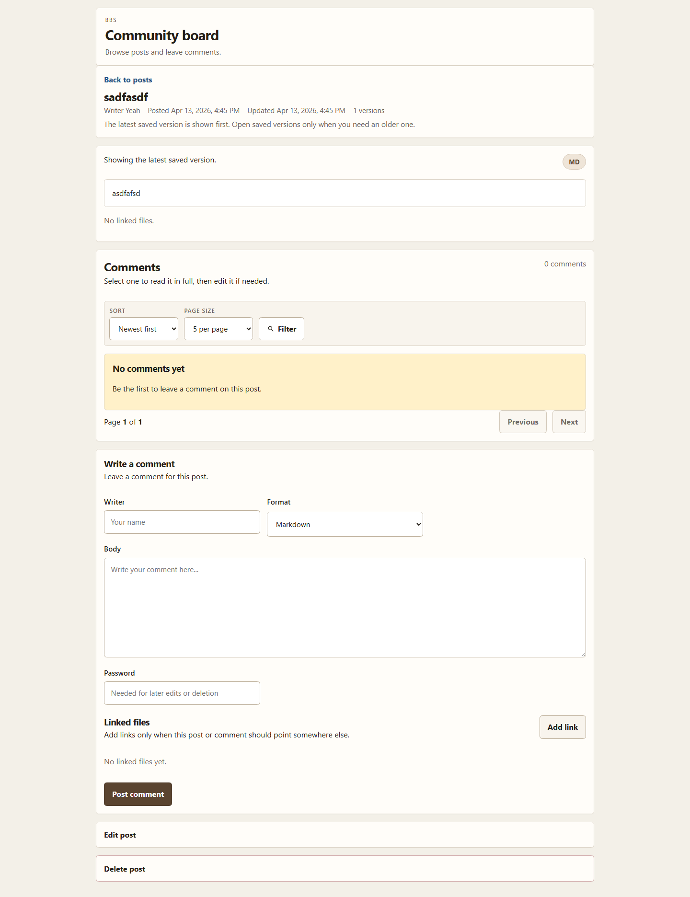
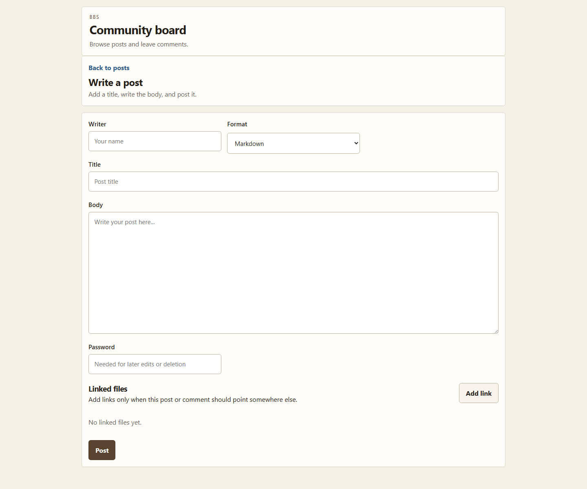

# bbs-frontend

This repo is a small proof that backend quality matters a lot. If the SDK is typed, the DTOs are clear, and the backend comments are decent, tools like Codex and Claude Code can automate a surprising amount of frontend work.

The point is not that AI will magically design everything well on its own. The point is that better backend documentation lowers frontend cost, shortens setup time, and makes agent-driven UI work much more realistic.

## Stack

- Next.js App Router
- React
- TypeScript
- `@samchon/bbs-api`
- React Query

## Screens

### Home



### Post Detail



### Write Post



## Run It

Start the backend first.

```bash
git clone https://github.com/samchon/bbs-backend
cd bbs-backend
pnpm install
pnpm build:main
pnpm start
```

Then start the frontend in another terminal.

```bash
git clone https://github.com/samchon/bbs-frontend
cd bbs-frontend
pnpm install
pnpm dev
```

Default addresses:

- Frontend: `http://127.0.0.1:3000`
- Backend: `http://127.0.0.1:37000`

If the backend host changes, set `NEXT_PUBLIC_BBS_API_HOST` before starting the frontend.

## Useful Commands

- `pnpm dev`
- `pnpm typecheck`
- `pnpm build`
- `pnpm start`
- `pnpm ui:review`

`pnpm ui:review` builds the app, runs it in Playwright, checks key controls, and saves fresh screenshots under `.artifacts/ui-review/`.
